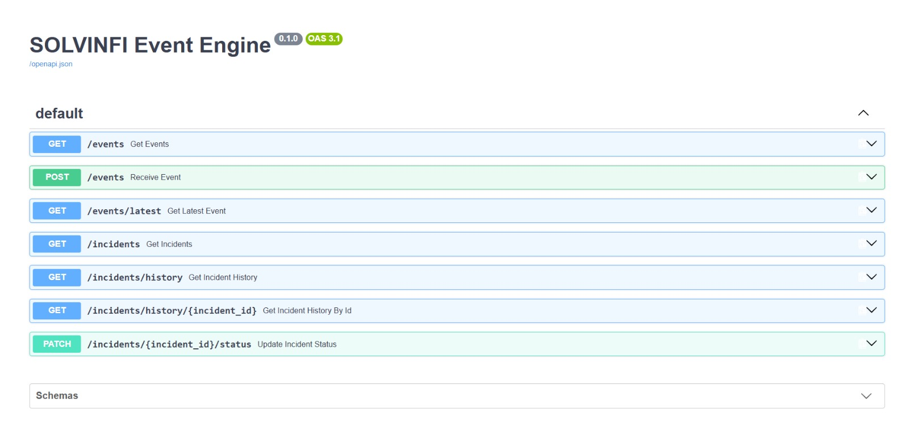
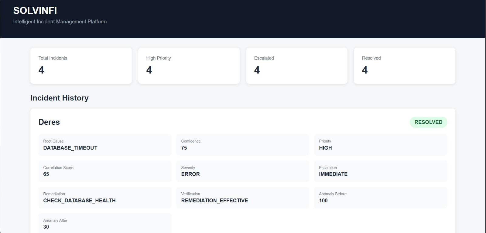
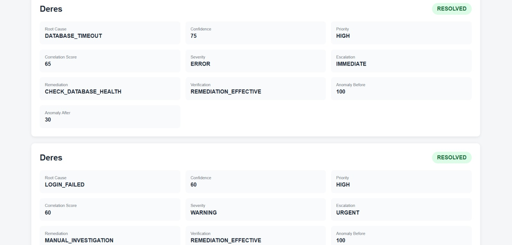
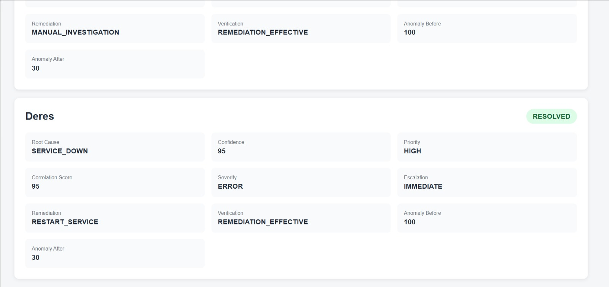

# SOLVINFI AI

## Intelligent Incident Detection, Analysis and Response System

SOLVINFI AI is an incident intelligence system that processes application and infrastructure events, identifies abnormal activity, determines whether the activity represents a significant incident, and carries the incident through a structured response workflow.

Instead of treating individual events as isolated log messages, SOLVINFI analyzes related events together to understand the incident, identify its probable root cause, determine its priority and escalation level, recommend an appropriate response, and verify the outcome.

The project is implemented as a modular Python application using Django for data persistence, FastAPI for API access, and an HTML/CSS/JavaScript dashboard for visualization.

---

## How It Works

```text
Incoming Events
      ↓
Event Receiver
      ↓
Event Database
      ↓
Event Correlation
      ↓
Anomaly Detection
      ↓
Root Cause Analysis
      ↓
Incident Classification
      ↓
Escalation
      ↓
Remediation
      ↓
Health Verification
      ↓
Incident Record
      ↓
API + Dashboard
```

Each stage contributes information to the next stage, allowing SOLVINFI to build a complete view of an incident rather than relying on a single event.

---

## Key Features

- Event ingestion and database storage
- Correlation of related events within a time window
- Anomaly and risk assessment
- Root cause identification with confidence scoring
- Incident priority classification
- Escalation evaluation
- Remediation recommendation
- Post-remediation health assessment
- Remediation verification
- Incident lifecycle tracking
- REST API with Swagger/OpenAPI documentation
- Web-based incident dashboard

---

## Core Components

### Event Engine

Receives events and provides API endpoints for event and incident operations.

### Correlation Engine

Groups related events from the same service within a defined time window and determines whether the activity is incident-relevant.

### Anomaly Detection

Evaluates recent activity using indicators such as failure rate, error count, warning count, and repeated event patterns to determine anomaly score and risk.

### Root Cause Analyzer

Analyzes the correlated activity and identifies the most probable root cause along with a confidence score and explanation.

### Escalation Engine

Evaluates incident severity, priority, correlation strength, and anomaly risk to determine whether escalation is required and assign an escalation level.

### Remediation Engine

Selects an appropriate response based on the identified incident and root cause.

### Verification Engine

Compares system health before and after remediation to determine whether the remediation was effective.

### Incident Orchestrator

Coordinates the complete incident-processing workflow and stores the resulting incident record.

---

## Example Incident Scenarios

SOLVINFI has been tested with different event patterns, including:

### Authentication Failures

```text
LOGIN_FAILED
LOGIN_FAILED
LOGIN_FAILED
```

Example result:

```text
Root Cause: LOGIN_FAILED
Priority: HIGH
Escalation: URGENT
Remediation: MANUAL_INVESTIGATION
Verification: REMEDIATION_EFFECTIVE
```

### Database Timeouts

```text
DATABASE_TIMEOUT
DATABASE_TIMEOUT
```

Example result:

```text
Root Cause: DATABASE_TIMEOUT
Priority: HIGH
Escalation: IMMEDIATE
Remediation: CHECK_DATABASE_HEALTH
Verification: REMEDIATION_EFFECTIVE
```

### Service Outage

```text
SERVICE_DOWN
```

Example result:

```text
Root Cause: SERVICE_DOWN
Priority: HIGH
Escalation: IMMEDIATE
Remediation: RESTART_SERVICE
Verification: REMEDIATION_EFFECTIVE
```

These scenarios demonstrate that the system produces different incident decisions based on the observed event pattern.

---

## API

SOLVINFI provides a FastAPI-based REST API with Swagger/OpenAPI documentation.

| Method | Endpoint | Purpose |
|---|---|---|
| GET | `/events` | Retrieve events |
| POST | `/events` | Receive an event |
| GET | `/events/latest` | Retrieve the latest event |
| GET | `/incidents` | Retrieve incidents |
| GET | `/incidents/history` | Retrieve incident history |
| GET | `/incidents/history/{incident_id}` | Retrieve a specific incident |
| PATCH | `/incidents/{incident_id}/status` | Update incident status |

Swagger documentation:

```text
http://127.0.0.1:9000/docs
```

---

## Dashboard

The dashboard provides a visual view of the incident information generated by SOLVINFI.

It includes:

- Incident statistics
- Priority and severity
- Root cause and confidence
- Correlation score
- Escalation status
- Remediation action
- Verification status
- Incident history
- Before/after health information

### Event Engine API



### Incident Dashboard



### Authentication Failure Incident



### Database Timeout Incident



---

## Technology Stack

- **Python**
- **Django** – application structure, ORM and data persistence
- **FastAPI** – REST API
- **Uvicorn** – API server
- **SQLite** – development database
- **HTML / CSS / JavaScript** – dashboard
- **Swagger / OpenAPI** – API documentation

---

## Project Structure

```text
SOLVINFI-AI/
│
├── anomaly_detection/
├── config/
├── correlation/
├── dashboard/
├── escalation/
├── event_engine/
├── health_monitoring/
├── incident_orchestrator/
├── incidents/
├── monitored_services/
├── monitoring/
├── remediation/
├── response_engine/
├── root_cause/
├── services/
├── verification/
├── Images/
│
├── manage.py
├── requirements.txt
├── .gitignore
└── README.md
```

---

## Running the Project

### 1. Create and activate a virtual environment

```powershell
python -m venv venv
.\venv\Scripts\Activate.ps1
```

### 2. Install dependencies

```powershell
pip install -r requirements.txt
```

### 3. Apply migrations

```powershell
python manage.py migrate
```

### 4. Start the API

```powershell
python -m uvicorn event_engine.api:app --port 9000
```

### 5. Open the application

**Dashboard**

```text
http://127.0.0.1:9000/dashboard
```

**Swagger**

```text
http://127.0.0.1:9000/docs
```

### 6. Run the incident orchestrator

```powershell
python incident_orchestrator\orchestrator.py
```

The orchestrator processes the available event data and produces the final incident intelligence.

---

## Incident Lifecycle

A processed incident moves through:

```text
DETECTED
   ↓
ANALYZED
   ↓
ESCALATED
   ↓
REMEDIATION
   ↓
VERIFICATION
   ↓
RESOLVED
```

The resulting information is stored as an incident record and made available through the API and dashboard.

---

## Implementation Note

The remediation and post-remediation health stages currently use a controlled simulation. This allows the complete detection-to-verification workflow to be demonstrated without making changes to real production infrastructure.

The architecture is modular so that these components can later be connected to real monitoring and service-management systems.

---

## Project Status

**Working Prototype**

SOLVINFI currently demonstrates an end-to-end incident intelligence workflow covering event ingestion, correlation, anomaly detection, root cause analysis, incident classification, escalation, remediation, verification, persistence, API access, and dashboard visualization.

---

## Author

**Deepak Ram**